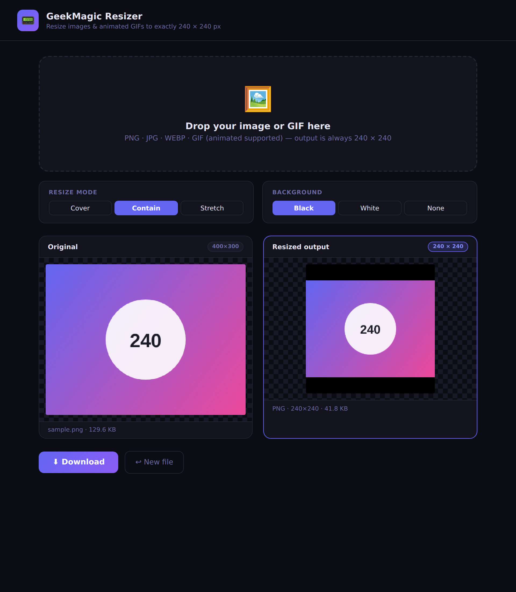

# GeekMagic Resizer 📟

A tiny, single-file web app that resizes any image or animated GIF to exactly **240 × 240 px** — the native resolution of the [GeekMagic SmallTV / mini display](https://www.geekmagic.com/).

Everything runs **client-side in your browser**. No uploads, no server, no tracking — your images never leave your machine.

## Features

- 🖼️ **Any format in** — PNG, JPG, WEBP, and animated GIF
- 🎞️ **Animated GIF support** — each frame is decoded, resized, and re-encoded so animations keep playing at 240 × 240
- 🎚️ **Three resize modes:**
  - **Cover** — scale to fill the square, cropping the overflowing edges
  - **Contain** — scale to fit inside the square, adding background bars (default)
  - **Stretch** — distort to fill the square exactly
- 🎨 **Background fills** — Black, White, or None (transparent, PNG output only)
- 👀 **Live side-by-side preview** of the original vs. the resized output
- ⬇️ **One-click download** — PNG for static images, GIF for animations
- 📱 **Responsive** — works on desktop and mobile, with drag-and-drop

## Usage

Open `index.html` in any modern browser, then:

1. **Drop** an image/GIF onto the drop zone (or click to browse)
2. Pick a **resize mode** and **background**
3. Preview the result and click **Download**
4. Copy the `240x240.png` / `240x240.gif` file to your GeekMagic display

That's it — there's nothing to install or build.

## Hosting

Because it's a single static file, you can host it for free almost anywhere:

- **GitHub Pages** — Settings → Pages → Deploy from `main` / root → live at `https://<user>.github.io/resizer/`
- **Netlify** — drag `index.html` onto [netlify.com/drop](https://app.netlify.com/drop)
- **Cloudflare Pages** / **Vercel** — connect the repo for auto-deploys on push

## How it works

Static images are drawn onto a 240 × 240 `<canvas>` and exported via `canvas.toBlob()`.

Animated GIFs are handled by two libraries loaded from a CDN at runtime:

| Library | Role |
|---|---|
| [`gifuct-js`](https://github.com/matt-way/gifuct-js) | Decodes GIF frames, including transparency and disposal methods |
| [`gif.js`](https://github.com/jnordberg/gif.js) | Re-encodes the resized frames into a new animated GIF |

Frame compositing respects GIF disposal modes (restore-to-background and restore-to-previous) so partial/optimized frames render correctly. The `gif.js` web worker is fetched as a blob URL to sidestep cross-origin worker restrictions.

> **Note:** GIF processing requires an internet connection on first use to fetch the CDN libraries. Static image resizing works fully offline.

## License

[MIT](LICENSE)
